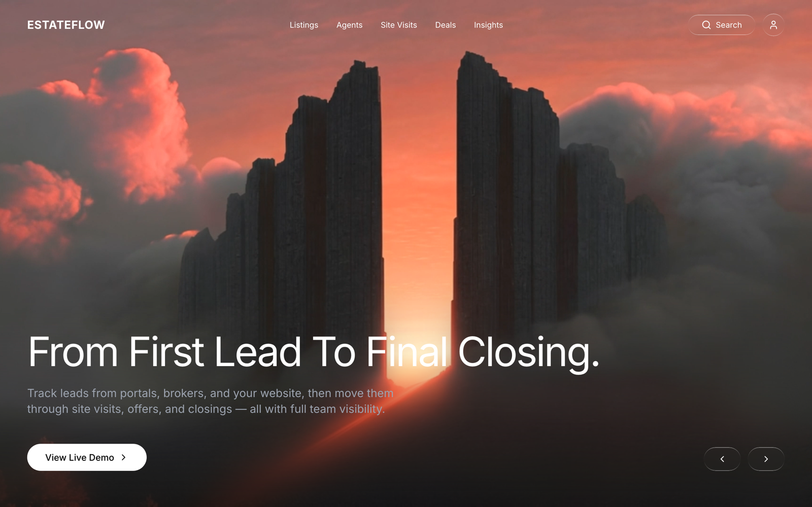
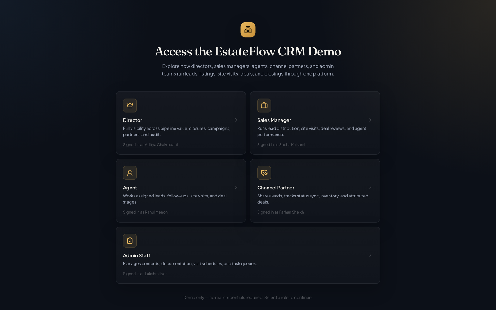
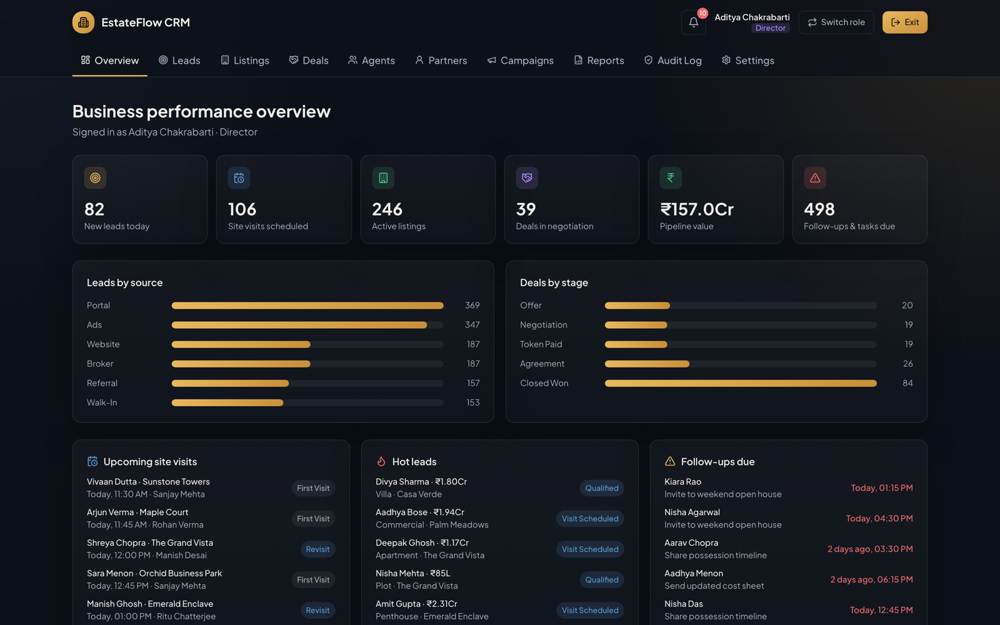

# EstateFlow CRM

A property sales and operations CRM for real estate developers and brokerages.
Five roles — **Director**, **Sales Manager**, **Agent**, **Channel Partner**,
and **Admin Staff** — share one dashboard shell and move the same records
through the funnel: leads in from portals, brokers, and walk-ins, through
site visits and negotiation, to signed deals and closed inventory.

**This is a self-contained demo build.** Every screen runs against a large,
realistic dataset generated in the browser at load time — 1,400 leads, 420
units across ten projects, 320 site visits, 180 deals, a 48-person team, and
more. There is no backend, no database, and no API key. Clone it, run two
commands, and every tab already has real-looking data to show. Read on for
exactly how that's done — including the one thing it does *not* do (persist
your changes across a reload) — and how to reshape the dataset for your own
walkthrough.

---

## Screenshots

<p align="center">
  
  <br /><em>Landing page</em>
  <br /><br />
  
  <br /><em>No-credentials role picker</em>
  <br /><br />
  
  <br /><em>Director overview dashboard</em>
</p>

---

## Table of contents

- [Quick start](#quick-start)
- [Demo login](#demo-login)
- [Features by role](#features-by-role)
- [Modules](#modules)
- [Architecture](#architecture)
- [Customizing the demo data](#customizing-the-demo-data)
- [Tech stack](#tech-stack)
- [Project structure](#project-structure)
- [Scripts](#scripts)
- [License](#license)

---

## Quick start

```bash
npm install
npm run dev
```

Open the URL Vite prints (usually `http://localhost:5173`). You'll land on
the marketing page; click **View Live Demo** to reach the role picker.

## Demo login

There's no username or password. [`src/components/auth/LoginScreen.tsx`](src/components/auth/LoginScreen.tsx)
shows five role cards — click one and you're immediately in the dashboard,
signed in as that role's fixed demo identity:

| Role | Signed in as | Scope |
|---|---|---|
| Director | Aditya Chakrabarti | Full visibility across pipeline value, closures, campaigns, partners, and audit. |
| Sales Manager | Sneha Kulkarni | Runs lead distribution, site visits, deal reviews, and agent performance. |
| Agent | Rahul Menon | Works assigned leads, follow-ups, site visits, and deal stages. |
| Channel Partner | Farhan Sheikh | Shares leads, tracks status sync, inventory, and attributed deals. |
| Admin Staff | Lakshmi Iyer | Manages contacts, documentation, visit schedules, and task queues. |

The **Switch role** button in the dashboard top bar drops you back to the
role picker at any time; **Exit** returns to the landing page. These five
identities are the `roleUser` map in [`src/data/seed.ts`](src/data/seed.ts) —
they're separate from the other ~43 people in the generated team roster,
so the named logins stay stable across every regeneration of the dataset.

## Features by role

Each role sees a different set of tabs, driven by the `roleTabs` map in
[`src/data/seed.ts`](src/data/seed.ts):

- **Director** — Overview, Leads, Listings, Deals, Agents, Partners,
  Campaigns, Reports, Audit Log, Settings. Read-only on day-to-day records;
  this is the cross-functional view.
- **Sales Manager** — Overview, Leads, Contacts, Listings, Site Visits,
  Deals, Agents, Tasks, Reports. The broadest working set — can advance
  leads, visits, deals, and tasks.
- **Agent** — Overview, Leads, Contacts, Site Visits, Deals, Tasks. The
  individual-contributor view; Overview scopes "hot leads" and "follow-ups
  due" down to leads assigned to that agent (or with a follow-up overdue).
- **Channel Partner** — Overview, Leads, Listings, Deals. Read-only —
  partners can see the shared pipeline but not edit it.
- **Admin Staff** — Overview, Contacts, Listings, Site Visits, Tasks, Audit
  Log. Operational support: manages listing status, visit outcomes, and
  the task queue, plus audit visibility.

Which roles can actually change state on a given page (advance a stage,
mark something done) is a separate, per-page `canManage` map — see the
table in [Modules](#modules) below.

## Modules

All thirteen dashboard pages live in
[`src/components/dashboard/`](src/components/dashboard) and are wired
into the tab bar by [`DashboardShell.tsx`](src/components/dashboard/DashboardShell.tsx).
Everything reads from and writes to [`useDemoData()`](src/context/DemoDataContext.tsx).

| Page | What it does |
|---|---|
| [`Overview.tsx`](src/components/dashboard/Overview.tsx) | Role-specific headline, six stat tiles (new leads today, site visits scheduled, active listings, deals in negotiation, pipeline value in ₹, follow-ups & tasks due), two bar-chart panels (leads by source, deals by stage), and three live lists — upcoming site visits, hot leads, and follow-ups due. For the **Agent** role, the lead-derived panels are scoped to that agent's own assigned leads. |
| [`Leads.tsx`](src/components/dashboard/Leads.tsx) | Searchable, filterable list of all leads. Sales Manager and Agent can advance a lead one stage at a time (`new → contacted → qualified → visit-scheduled → negotiation → won`) or mark it lost. |
| [`Contacts.tsx`](src/components/dashboard/Contacts.tsx) | Read-only directory of buyers, sellers, renters, and investors — search and type filter only, no mutation. |
| [`Listings.tsx`](src/components/dashboard/Listings.tsx) | Unit/inventory list across all projects. Sales Manager and Admin Staff can place a unit on hold or release it back to available. |
| [`SiteVisits.tsx`](src/components/dashboard/SiteVisits.tsx) | Scheduled/completed/no-show/cancelled site visit list. Sales Manager, Agent, and Admin Staff can mark a scheduled visit completed or as a no-show. |
| [`Deals.tsx`](src/components/dashboard/Deals.tsx) | Deal pipeline (`offer → negotiation → token-paid → agreement → closed-won`, or `lost`). Sales Manager and Agent can advance a deal's stage; closing a deal (`closed-won`) also flips its linked unit's status to `sold` — see [Architecture](#architecture). |
| [`Agents.tsx`](src/components/dashboard/Agents.tsx) | Read-only team roster — name, title, region, phone, deals closed, last login — filterable by role. |
| [`Partners.tsx`](src/components/dashboard/Partners.tsx) | Read-only channel partner directory — firm, contact, leads shared, deals closed, commission rate, status. |
| [`Campaigns.tsx`](src/components/dashboard/Campaigns.tsx) | Read-only marketing campaign list — channel, leads generated, conversions, spend, status. |
| [`Tasks.tsx`](src/components/dashboard/Tasks.tsx) | Task queue (open/overdue/done). Sales Manager, Agent, and Admin Staff can mark a task done. |
| [`Reports.tsx`](src/components/dashboard/Reports.tsx) | Seven computed summary cards (pipeline, leads by source, inventory, closures & revenue, agent performance, visit conversion, campaign performance) scoped to a date-range selector (This week / This month / All time). **Export as CSV** is a real, working export — it builds a CSV client-side with a `Blob` and triggers a browser download of the current numbers plus the last 30 audit entries; no server round-trip. |
| [`AuditLog.tsx`](src/components/dashboard/AuditLog.tsx) | Searchable, filterable, paginated table of every logged action in the system — see, in real time, every mutation any role makes during the session. |
| [`Settings.tsx`](src/components/dashboard/Settings.tsx) | Read-only reference view of the ten configured projects (with live unit counts per project), the five property types, and the twelve localities covered — there's nothing to save, so there's no save button. |

Every list page above (all except Overview, Reports, Audit Log, and
Settings) is built from the same shared scaffold in
[`src/components/primitives.tsx`](src/components/primitives.tsx):
`ListCard`, `useListControls` (search + filter + "show more" paging),
`SearchInput`, `FilterSelect`, `RowAction`, and `StatusBadge` (which maps
any status string to a consistent color via keyword matching in `toneFor`).
Adding a fully-functional new list tab is mostly wiring a `matches()`
predicate into `useListControls` and mapping fields into a row — see any
of the files above for the pattern.

## Architecture

### There is no backend — and no persistence either

[`src/context/DemoDataContext.tsx`](src/context/DemoDataContext.tsx) is the
entire data layer. It holds the mutable collections — `leads`, `visits`,
`deals`, `units`, `tasks`, `auditLog`, `notifications` — in plain
`useState`, seeded once from the generated dataset:

```tsx
export function DemoDataProvider({ children }: { children: ReactNode }) {
  const [leads, setLeads] = useState<Lead[]>(initialLeads)
  const [visits, setVisits] = useState<SiteVisit[]>(initialVisits)
  const [deals, setDeals] = useState<Deal[]>(initialDeals)
  const [units, setUnits] = useState<Unit[]>(initialUnits)
  const [tasks, setTasks] = useState<CrmTask[]>(initialTasks)
  // ...
```

Collections nothing in the UI ever mutates — `team`, `contacts`,
`partners`, `campaigns` — are exposed straight from the generated dataset
without a `useState` wrapper at all.

**There is no `localStorage`, `sessionStorage`, or network call anywhere in
this codebase.** Every action you take — advancing a lead, closing a deal,
marking a task done — lives only in React state for the lifetime of the
tab. Reload the page and you're back to the original generated dataset.
This is a deliberate trade-off for a demo: it means there's no stale
`localStorage` to clear between walkthroughs and no "reset demo data"
button to remember to click — a hard refresh *is* the reset.

### Why the data looks the same every time anyway

[`src/data/generate.ts`](src/data/generate.ts) builds the whole dataset with
a seeded PRNG (`mulberry32`) driven by a fixed constant:

```ts
const SEED = 20260703
// ...
export function generateDemoData() {
  const rng = mulberry32(SEED)
  const team = generateTeam(rng, 48)
  const sellingAgents = team.filter((t) => t.role === 'Agent')
  const units = generateUnits(rng, sellingAgents, 420)
  const leads = generateLeads(rng, sellingAgents, 1400)
  const contacts = generateContacts(rng, 450)
  const visits = generateVisits(rng, leads, units, sellingAgents, 320)
  const partners = generatePartners(rng)
  const deals = generateDeals(rng, units, sellingAgents, partners, 180)
  const campaigns = generateCampaigns(rng)
  const tasks = generateTasks(rng, sellingAgents, 64)
  const auditLog = generateAuditLog(rng, leads, visits, deals, units, team, 1000)
  const notifications = generateNotifications(rng, leads, visits, deals, 18)
  return { team, units, leads, contacts, visits, partners, deals, campaigns, tasks, auditLog, notifications }
}
```

[`src/data/seed.ts`](src/data/seed.ts) calls `generateDemoData()` once at
module load (`const demo = generateDemoData()`), so every field is
"randomly" generated but deterministic — the same seed always produces the
same 1,400 leads with the same names, stages, and dates-relative-to-today.
That's why the app looks fully populated and internally consistent (unit
codes referenced by deals actually exist, visit dates cluster sensibly
around "today") without ever hard-coding a fixture file by hand. Dates are
computed relative to `Date.now()` at generation time (`makeSortTs`,
`dayLabel`), so "Today," "Yesterday," and "In 3 days" labels are always
accurate to whenever you load the app — but this also means the dataset,
not just the UI state, regenerates fresh on every reload.

### Mutations are centralized and self-logging

Every write path in `DemoDataContext` — `advanceLeadStage`,
`recordVisitOutcome`, `advanceDealStage`, `setUnitStatus`, `completeTask`,
`exportReport` — funnels through an internal `logAction()` helper that
prepends a new `AuditEntry` to `auditLog`. That's the entire mechanism
behind the Audit Log tab: it's not a separate feed, it's the same
`auditLog` state array everything else reads, with new entries added live
as any role acts.

One entity relationship is worth calling out: closing a deal cross-updates
inventory —

```ts
function advanceDealStage(id: string, stage: DealStage, role: Role) {
  const deal = deals.find((d) => d.id === id)
  if (!deal) return
  setDeals((prev) => prev.map((d) => (d.id === id ? { ...d, stage } : d)))
  if (stage === 'closed-won') {
    setUnits((prev) => prev.map((u) => (u.code === deal.unitCode ? { ...u, status: 'sold' } : u)))
  }
  logAction(role, 'Deals', `Updated deal stage — ${deal.clientName}, ${deal.unitCode} (${deal.valueLabel})`, stage.replace('-', ' '))
}
```

Records reference each other by plain string keys (`unitCode`, agent
`name`), not database foreign keys — simple enough to read end-to-end in
one file, and exactly what you'd refactor first if this became a real app
with a real datastore.

### No router, no auth library

[`src/App.tsx`](src/App.tsx) is a three-state view switch —
`'landing' | 'login' | 'dashboard'` — held in a single `useState`, no
React Router. "Auth" is just picking a `Role` in `LoginScreen`; there's no
session, no token, no user database to check against.

## Customizing the demo data

- **Change the dataset size** — edit the count arguments passed to each
  `generate*()` call inside `generateDemoData()` at the bottom of
  [`src/data/generate.ts`](src/data/generate.ts) (currently 48 team
  members, 420 units, 1,400 leads, 450 contacts, 320 visits, 180 deals, 64
  tasks, 1,000 audit entries, 18 notifications).
- **Get a different (still stable) shuffle** — change the `SEED` constant
  near the top of `generate.ts`.
- **Reshape the word banks** — projects, localities, first/last names,
  campaign names, partner firms, visit outcomes, follow-up notes, and
  contact notes are all plain arrays in
  [`src/data/names.ts`](src/data/names.ts).
- **Change the five demo logins** — `roleUser` in
  [`src/data/seed.ts`](src/data/seed.ts) controls the names shown on the
  role picker; `FIXED_TEAM` in `generate.ts` controls their full profile
  fields (title, phone, email, region, deals closed).
- **Change which tabs a role sees** — `roleTabs` in `src/data/seed.ts`.
- **Change who can act on a given page** — the `canManage` record at the
  top of each dashboard component (e.g. `src/components/dashboard/Leads.tsx`)
  maps `Role → boolean`.
- **Reset the demo** — just reload the page. Since nothing persists (see
  [Architecture](#architecture)), there's no cache or storage to clear.

## Tech stack

| | |
|---|---|
| Framework | React 18.3 + TypeScript |
| Build tool | Vite 5 |
| Styling | Tailwind CSS 3.4 — custom `estate` color palette and `Fraunces` / `Plus Jakarta Sans` fonts in [`tailwind.config.js`](tailwind.config.js), fonts loaded from Google Fonts in [`src/index.css`](src/index.css) |
| Icons | Lucide (`lucide-react`) |
| Animation | [Motion](https://motion.dev) (`motion/react`, the successor to Framer Motion) — entrance transitions on the login screen and landing page |
| Routing | None — [`src/App.tsx`](src/App.tsx) is a plain three-state view switch |
| State | React Context + `useState` only — no Redux, Zustand, or query library |
| Data / backend | None — the entire dataset is generated in-browser at module load; no API calls, no environment variables required |

## Project structure

```
src/
  App.tsx                    — view switch: landing → login → dashboard
  main.tsx                   — React root
  index.css                  — Tailwind entry, fonts, hero/glass effects
  types.ts                   — every domain type (Role, Lead, Unit, Deal, ...)
  context/
    DemoDataContext.tsx       — the entire data layer (state + mutations + audit logging)
  data/
    generate.ts                — seeded-PRNG dataset generator
    seed.ts                     — calls generate.ts once, exports role/tab config
    names.ts                     — word banks: projects, localities, names, firms
  components/
    Landing.tsx               — marketing page (video hero, no auth)
    primitives.tsx             — Logo, buttons, StatusBadge, shared list scaffold
    auth/
      LoginScreen.tsx           — 5-role picker, no credentials
    dashboard/
      DashboardShell.tsx         — top bar, tab nav, notification bell
      Overview.tsx                — role-scoped KPIs and live lists
      Leads.tsx                    — lead pipeline
      Contacts.tsx                  — buyer/seller/renter/investor directory
      Listings.tsx                   — unit inventory
      SiteVisits.tsx                   — visit scheduling/outcomes
      Deals.tsx                         — deal pipeline
      Agents.tsx                         — team roster
      Partners.tsx                        — channel partner directory
      Campaigns.tsx                        — marketing campaigns
      Tasks.tsx                             — task queue
      Reports.tsx                            — computed summaries + CSV export
      AuditLog.tsx                            — every logged action, searchable
      Settings.tsx                             — projects/types/localities reference
```

## Scripts

```bash
npm run dev       # start the Vite dev server
npm run build     # tsc (type-check) then vite build → dist/
npm run preview   # serve the production build locally
```

## License

Use this however you'd like — as a portfolio reference, a starting point
for your own CRM demo, or as an example of how far a purely client-side,
seeded-data app can go without a backend.
